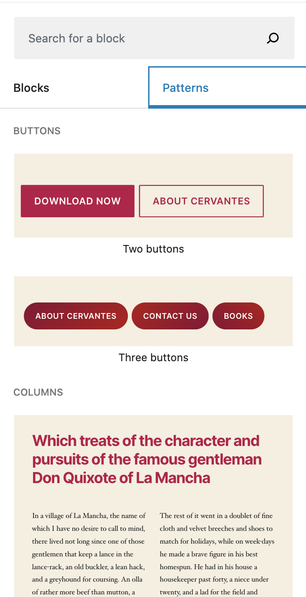

With WordPress v5.5 block patterns have become available. Core ships with some default patterns and offers you the option to register your own patterns and pattern categories as well as an option to remove the core patterns.



## Register a block pattern

Use `register_block_pattern` ([full documentation](https://developer.wordpress.org/block-editor/developers/block-api/block-patterns/)) to add your own patterns. Make sure to add appropriate `Requires` headers to your plugin or theme and check whether the function is available for best compatibility.

This function expects a pattern name (including a namespace, i.e. `rafhun/example-pattern`) and an array of arguments, two of which are required (`title` and `content`).

```php
<?php
register_block_pattern('rafhun/example-pattern', [
  'title' => __('Human readable pattern name', 'text-domain'),
  'content' => 'Raw HTML, see below',
  'description' => __('Visually hidden text that describes the pattern', 'text-domain'),
  'categories' => [
    'buttons',
    'columns',
    'gallery',
    'headings',
    'text',
    'your-own-category',
  ],
  'keywords' => [
    __('similar to the block keywords', 'text-domain'),
    __('used to improve discoverability of the block', 'text-domain'),
  ],
  'viewportWidth' => 'specify width of pattern in inserter',
]);
```

The `content` key of the argument's array expects raw HTML of the pattern. The easiest way to get this is to create your pattern in the block editor, then copy-pasting the code it generates in the frontend. Then make sure to escape quotes and add i18n functions around translatable strings.

For `categories` choose one of the default categories in core (listed above) or register your own (see below).

## Register a pattern category

Use the `register_block_pattern_category` function ([full documentation](https://developer.wordpress.org/block-editor/developers/block-api/block-patterns/#register_block_pattern_category)) if you wish to add a new category to the pattern inserter. This function expects a category name and its label within an array.

```php
register_block_pattern_category('example-category', [
  'label' => __('Category name', 'text-domain'),
]);
```

## Unregister block patterns or categories

You can remove core patterns or pattern categories using `unregister_block_pattern` and `unregister_block_pattern_category`. The only expected argument of both functions is the name of the pattern (i. e. `rafhun/example-pattern`) or the pattern category (`example-category`).

```php
unregister_block_pattern('rafhun/example-pattern');
unregister_block_pattern_category('example-category');
```
